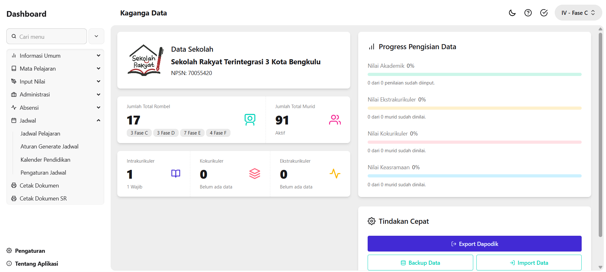

# Kaganga Data



<a href='https://nodejs.org/en' target="_blank"></a> <a href='https://svelte.dev/' target="_blank"></a> <a href='https://orm.drizzle.team/' target="_blank"></a> <a href='https://sqlite.org/' target="_blank"></a> <a href='https://tailwindcss.com/' target="_blank"></a> <a href='https://daisyui.com/' target="_blank"></a>

Kaganga Data adalah aplikasi administrasi dan informasi data sekolah untuk rapor, absensi, jadwal, kalender pendidikan, data pegawai, data murid, dan kebutuhan sekolah terpadu.

Dokumentasi lengkap proyek disusun dalam bahasa Indonesia. File ini memberi ringkasan cepat untuk pengguna dan pengembang; bagian teknis dan pedoman kontribusi ada di folder `docs/`.

## Fitur Utama

- Mengelola data sekolah, kelas, pegawai, murid, dan mata pelajaran
- Input nilai formatif, sumatif, kokurikuler, ekstrakurikuler, dan keasramaan
- Mengelola absensi, jadwal pelajaran, kalender pendidikan, dan data kesehatan murid
- Mencetak rapor, dokumen SR, kartu absensi, jadwal, kalender pendidikan, dan dokumen pendukung siap cetak

## Siapa yang Cocok Menggunakan

- Sekolah yang membutuhkan aplikasi lokal untuk mengelola data rapor, administrasi, absensi, jadwal, dan dokumen sekolah rakyat secara lebih rapi.
- Tim sekolah yang ingin tetap bisa bekerja di jaringan lokal tanpa bergantung penuh pada layanan online.

## Quickstart — Versi Pengguna (Windows Installer)

1. Kunjungi halaman rilis: https://github.com/Argilang14/Kaganga-Data/releases
2. Unduh `KagangaSetup.exe` dan jalankan installer.
3. Setelah terpasang, buka aplikasi dari shortcut yang tersedia.

Untuk instalasi manual Kaganga dan pengembangan Kaganga, baca [docs/DEVELOPMENT.md](https://github.com/Argilang14/Kaganga-Data/blob/main/docs/DEVELOPMENT.md).

## Menjalankan Versi Pengembangan (untuk pengembang)

Persyaratan:

- Node.js 20 LTS atau versi yang sesuai dengan runtime proyek
- pnpm
- Google Chrome atau Chromium untuk rendering PDF via PagedJS + Puppeteer

Langkah singkat:

```bash
pnpm install
pnpm dev -- --port 1206
```

Buka http://localhost:1206 di browser. Jika port 1206 sudah digunakan, jalankan dengan `--port 1207`.

Beberapa skrip penting (lihat `package.json`):

- `pnpm dev` — jalankan server pengembangan melalui `node scripts/dev.js`
- `pnpm build` — buat build produksi
- `pnpm db:push` — jalankan migrasi database Drizzle
- `pnpm db:studio` — buka Drizzle Studio untuk inspeksi database
- `pnpm lint` dan `pnpm check` — cek format, lint, dan tipe Svelte

Lokasi database lokal: `data/database.sqlite3`.

## Struktur Proyek (singkat)

- `src/` — kode sumber SvelteKit: komponen, route, API, dan server helper
- `static/` — aset statis yang disajikan apa adanya
- `scripts/` — skrip utilitas untuk migrasi, build, seed, dan packaging
- `data/` — lokasi database lokal dan upload, tidak untuk data produksi di Git
- `drizzle/` — file migrasi SQL yang digunakan oleh Drizzle
- `docs/` — dokumentasi pengembangan, update, dan catatan teknis

Lebih detil tentang pola implementasi Svelte 5, DaisyUI, TailwindCSS 4, dan Drizzle ORM ada di [docs/DEVELOPMENT.md](https://github.com/Argilang14/Kaganga-Data/blob/main/docs/DEVELOPMENT.md).

## Update Aplikasi

Alur update Kaganga memakai metadata publik `latest.json`. Source utama tetap berada di repo private, sedangkan info versi terbaru bisa dibaca aplikasi dari repo update publik.

Dokumen alur update tersedia di [docs/update/README.md](docs/update/README.md).

## Lisensi & Pengecualian

Perangkat lunak ini menggunakan lisensi khas (custom license). Anda bebas menggunakan, memodifikasi, dan membagikannya untuk keperluan nonkomersial selama mencantumkan atribusi. Dilarang menjual atau memonetisasi perangkat lunak ini maupun hasil modifikasinya. Lihat file `LICENSE` di root untuk ketentuan lengkap dan daftar aset yang dicakup.

Ikon pada `src/lib/icons` berasal dari [Feather](https://github.com/feathericons/feather) dan dirilis di bawah lisensi MIT — rincian dan kredit ada di [docs/ICON-CREDITS.md](https://github.com/Argilang14/Kaganga-Data/blob/main/docs/ICON-CREDITS.md).

## Kontribusi

Terima kasih jika Anda ingin berkontribusi.

- Ikuti panduan kode dan gunakan `pnpm lint` + `pnpm check` sebelum mengirim perubahan.
- Gunakan bahasa Indonesia untuk user-facing copy, teks antarmuka, dan dokumentasi pengguna.
- Tambahkan tes kecil atau deskripsi manual langkah verifikasi bila mengubah fungsionalitas penting.

Lihat [docs/DEVELOPMENT.md](https://github.com/Argilang14/Kaganga-Data/blob/main/docs/DEVELOPMENT.md) untuk alur kerja development yang disarankan dan skrip helper.

## Bantuan

Jika menemukan masalah, buka issue di GitHub repo atau hubungi pemilik/kontributor yang tercantum di halaman release atau dalam file [docs/](https://github.com/Argilang14/Kaganga-Data/blob/main/docs/).
